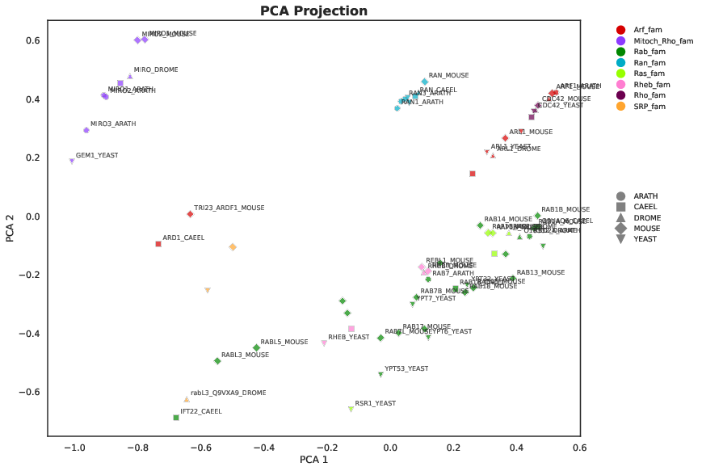
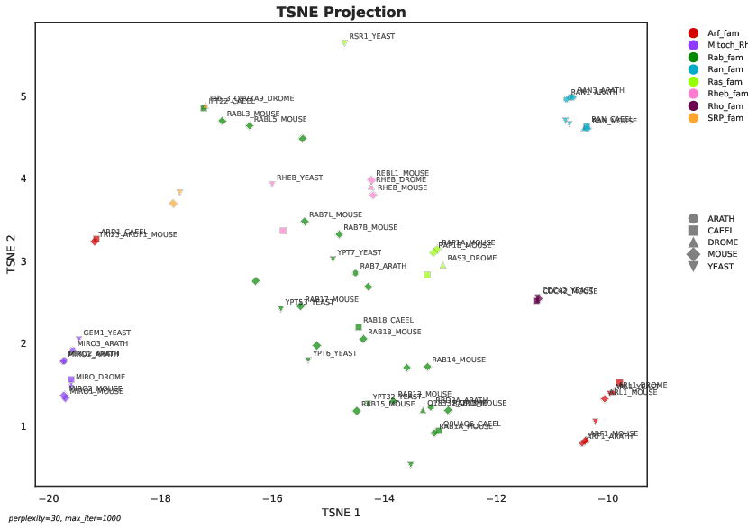

# Protein Embedding and Visualization Pipeline

This document describes the recommended pipeline for generating and visualizing protein embeddings using the provided scripts. Each step links to detailed documentation for the relevant script or module.

---

## Pipeline Steps

### a) Prepare Your Input Data
- **Format:** You can use either a TSV (tab-separated values) file or a FASTA file containing your protein sequences.
- **TSV:** Should include at least a unique identifier column (e.g., `uniprot_id`) and a sequence column (e.g., `sequence`).
- **FASTA:** Standard FASTA format with headers and sequences.

**Example:**
- Example TSV: [`data/RAS.updated.Info.Table.V7.tsv`](data/RAS.updated.Info.Table.V7.tsv)
- Example FASTA: [`data/RAS.fasta`](data/RAS.fasta)

```bash
# Example TSV
uniprot_id	sequence
P12345	MKTAYIAKQRQISFVKSHFSRQ...
...

# Example FASTA
>P12345
MKTAYIAKQRQISFVKSHFSRQ...
...
```

---

### b) Generate Embeddings
- Use the [`generate_embeddings.py`](README_generate_embeddings.md) script to generate embeddings for your sequences using a selected model.
- If your desired model is not available, you can [build your own model module](README_build_model_module.md) and place it in the `models/` directory.

**Example Command:**
```bash
python generate_embeddings.py --input data/RAS.fasta --input_type fasta --model_type prot_t5 --output embeddings.pkl
```

- See the [embedding script documentation](README_generate_embeddings.md) for more details and options.
- See the [model module guide](README_build_model_module.md) to add custom models.
- Example output: [`embeddings/prost_t5_embeddings.pkl`](embeddings/prost_t5_embeddings.pkl)

---

### c) Generate Plots and Visualizations
- Use the [`generate_visualizations.py`](README_generate_visualizations.md) script to create heatmaps and 2D projections (UMAP, t-SNE, PCA) from your embeddings and metadata.

**Example Command:**
```bash
python generate_visualizations.py data/RAS.updated.Info.Table.V7.tsv -e embeddings.pkl
```

- See the [visualization script documentation](README_generate_visualizations.md) for all options and examples.
- Example output files (click images for PDF):

#### Heatmap
[](exampleplots/all_heatmap_cosine_Family.name_prost_t5_embeddings.pdf)

#### UMAP (PCA projection example)
[](exampleplots/all_PCA_projection_Family.name_prost_t5_embeddings.pdf)

#### t-SNE
[](exampleplots/all_TSNE_projection_Family.name_prost_t5_embeddings.pdf)

---

## Summary
1. **Prepare your input**: TSV or FASTA file with protein sequences ([example TSV](data/RAS.updated.Info.Table.V7.tsv), [example FASTA](data/RAS.fasta)).
2. **Generate embeddings**: Use or build a model module, then run the embedding script ([example output](embeddings/prost_t5_embeddings.pkl)).
3. **Visualize**: Use the visualization script to generate publication-quality plots (see PNG previews above).

For more details, see the linked documentation files for each step.
