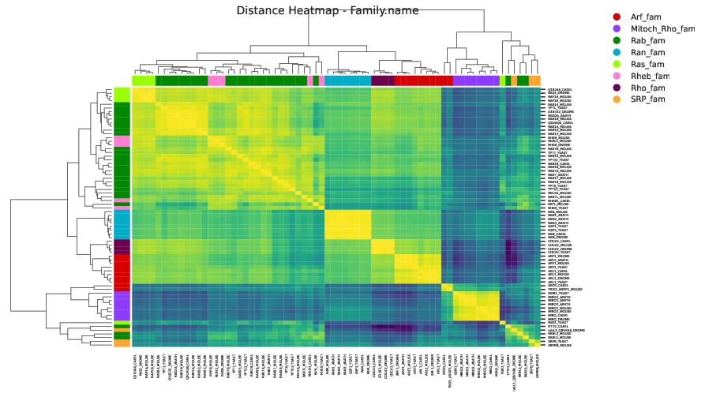
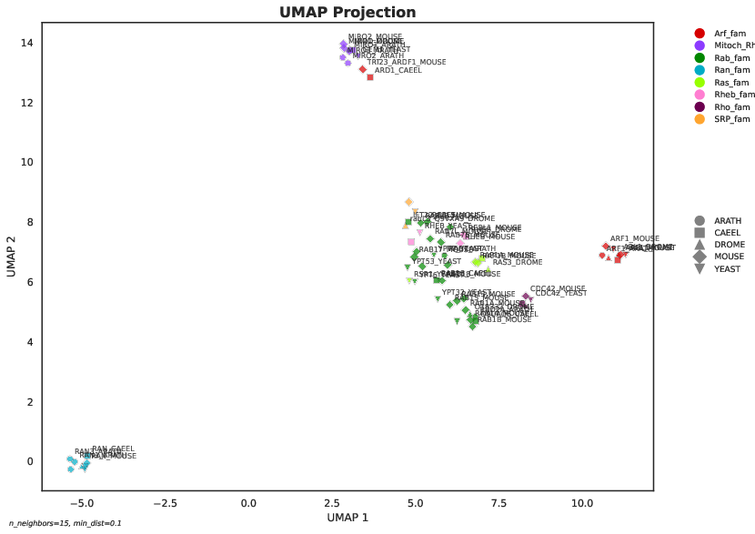
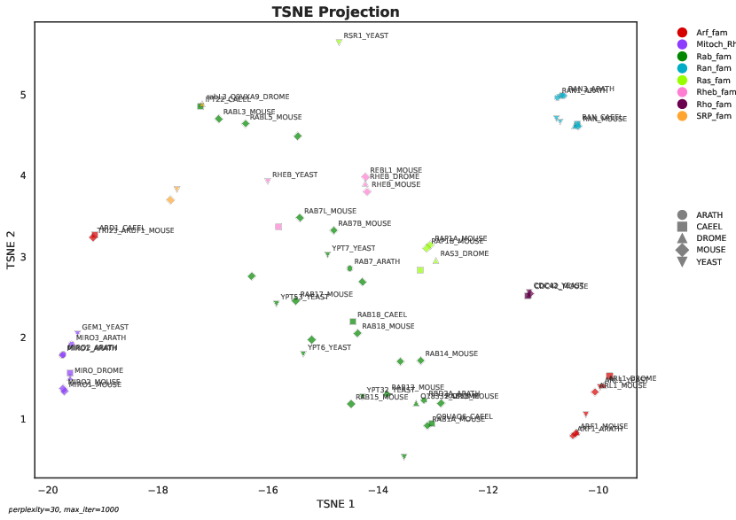
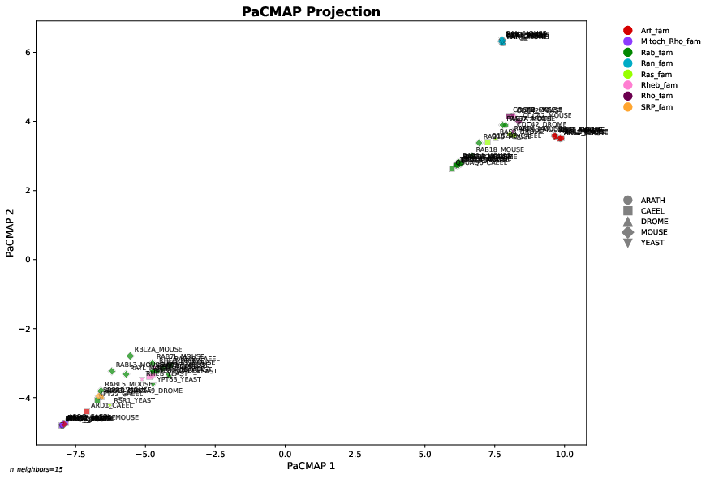

# Protein Embedding Visualization Script

This script generates visualizations for protein embeddings, including:
- Distance heatmaps
- 2D projections (UMAP, t-SNE, PCA, PaCMAP)
- Multiple input formats
- Customizable output

## Supported Methods
- UMAP
- t-SNE
- PCA
- PaCMAP ([GitHub](https://github.com/YingfanWang/PaCMAP))

## Example Output
See [`exampleplots/`](exampleplots/) for example plots:
- [All heatmap cosine Family.name prost_t5 embeddings (PDF)](exampleplots/all_heatmap_cosine_Family.name_prost_t5_embeddings.pdf)
- [All PCA projection Family.name prost_t5 embeddings (PDF)](exampleplots/all_PCA_projection_Family.name_prost_t5_embeddings.pdf)
- [All TSNE projection Family.name prost_t5 embeddings (PDF)](exampleplots/all_TSNE_projection_Family.name_prost_t5_embeddings.pdf)
- [PaCMAP projection Family.name ankh_s2s embeddings (PDF)](exampleplots/PaCMAP_projection_Family.name_ankh_s2s_embeddings.pdf)

## How to Run
See script docstring and CLI help for details.
# generate_visualizations.py Documentation

## Overview
`generate_visualizations.py` is an advanced script for visualizing protein embeddings. It supports multiple input formats, flexible color and clustering options, and produces publication-quality heatmaps and 2D projections (UMAP, t-SNE, PCA).

---

## Requirements
Python 3.7+
pandas
numpy
seaborn
matplotlib
scikit-learn
umap-learn
colorcet
h5py (optional, for HDF5 input)
pacmap (for PaCMAP projections)

Install requirements (example):
```bash
pip install pandas numpy seaborn matplotlib scikit-learn umap-learn colorcet h5py pacmap
```

---

## Usage

### Basic Command
```bash
python generate_visualizations.py data/RAS.updated.Info.Table.V7.tsv -e embeddings.pkl
```
- Example metadata: [`data/RAS.updated.Info.Table.V7.tsv`](data/RAS.updated.Info.Table.V7.tsv)
- Example embeddings: [`embeddings/prost_t5_embeddings.pkl`](embeddings/prost_t5_embeddings.pkl)

### Arguments
- `input_table` (positional): Path to metadata table (TSV/CSV)
- `-e`, `--embeddings`: Path to embeddings file (.pkl, .npz, .h5, .hdf5)
- `-c`, `--color_column`: Column name for coloring (default: Family.name)
- `--color_columns`: List of columns for multiple colorings
- `--id_column`: Column name for sequence IDs (default: uniprot_id)
- `-m`, `--distance_metric`: Distance metric for heatmap (`cosine`, `euclidean`, default: cosine)
-- `-p`, `--projection_method`: Projection method (`UMAP`, `TSNE`, `PCA`, `PaCMAP`, default: UMAP)
-- `--methods`: List of projection methods to generate (can include `PaCMAP`)
- `--embedding_files`: List of embedding files to visualize
- `--palette_name`: Color palette (glasbey, tab10, Set3, husl, default: glasbey)
- `--figsize`: Figure size (width height, default: 11.69 8.27)
- `--output_format`: Output format (`pdf`, `png`, `svg`, default: pdf)
- `--dpi`: Output DPI (default: 300)
- `--show_labels`: Show protein ID labels on projections
- `--max_labels`: Maximum number of labels to show (default: 100)
- `--label_fontsize`: Font size for labels (default: 8)
- `--show_species`: Use different markers for each species (from uniprot_id)
- `--skip_heatmap`: Skip heatmap generation

---

## Output
- Heatmaps of pairwise distances (with clustering and color-coded rows)
    - Example:
      [](exampleplots/all_heatmap_cosine_Family.name_prost_t5_embeddings.pdf)
- 2D projections (UMAP, t-SNE, PCA) with flexible coloring and labeling
    - Example PCA :
    [](exampleplots/all_PCA_projection_Family.name_prost_t5_embeddings.pdf)
    - Example UMAP :
      [](exampleplots/all_UMAP_projection_Family.name_prost_t5_embeddings.pdf)
    - Example t-SNE:
      [](exampleplots/all_TSNE_projection_Family.name_prost_t5_embeddings.pdf)
    - Example PaCMAP:
      [](exampleplots/PaCMAP_projection_Family.name_ankh_s2s_embeddings.pdf)
- Output files are named automatically based on method, color, and embedding file

---

## Examples

### 1. Basic heatmap and UMAP projection
```bash
python generate_visualizations.py data/RAS.updated.Info.Table.V7.tsv -e embeddings.pkl
```

### 2. Multiple color columns and projection methods
```bash
python generate_visualizations.py data/RAS.updated.Info.Table.V7.tsv -e embeddings.pkl --color_columns Family.name New Classic --methods UMAP TSNE PaCMAP
```

### 3. Visualize multiple embedding files
```bash
python generate_visualizations.py data/RAS.updated.Info.Table.V7.tsv --embedding_files model1.pkl model2.pkl --color_column Family.name --methods UMAP PaCMAP
```

### 4. Show species markers and protein labels
```bash
python generate_visualizations.py data/RAS.updated.Info.Table.V7.tsv -e embeddings.h5 --color_column Family.name --projection_method PaCMAP --palette_name husl --show_labels --show_species
```

---

## Notes
- Input embeddings can be in pickle, npz, or hdf5 format.
- Metadata table can be TSV or CSV; separator is auto-detected.
- For large datasets, label and legend sizes are automatically adjusted.
- Use `--show_species` to distinguish species by marker (species is extracted from uniprot_id after the last underscore).
- For PaCMAP projections, ensure the `pacmap` library is installed (`pip install pacmap`).

---

## Troubleshooting
- If you see file format errors, check that your embeddings and metadata files are valid and supported.
- For HDF5 input, ensure `h5py` is installed.
- For color/labeling issues, check that your metadata columns match the script arguments.

---

## License
MIT or as specified in the repository.
