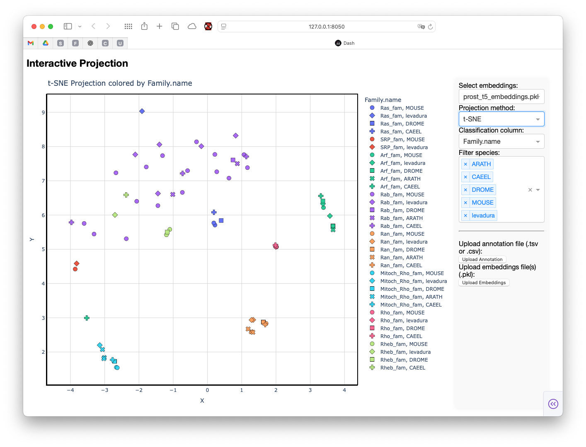

# Interactive Protein Embedding Visualization

This Dash app provides an interactive interface for visualizing protein embeddings using dimensionality reduction methods (UMAP, PCA, t-SNE, PaCMAP) and metadata annotation. Users can upload new embeddings and annotation files, filter by species, and explore projections colored by classification columns.

## Features
- Upload and visualize protein embeddings (.pkl format)
- Upload annotation/metadata files (.tsv or .csv)
- Dynamic dropdowns for classification and species filtering
- Supports UMAP, PCA, t-SNE, and PaCMAP projections
- Reports unmatched proteins between embeddings and metadata
- Interactive scatter plot with hover and symbol options

## Usage

### 1. Install Requirements
Ensure all dependencies are installed:
```bash
pip install dash plotly pandas numpy umap-learn scikit-learn pacmap
```

### 2. Run the App
```bash
python interactive_visualizations.py
```
The app will start a local server (default: http://127.0.0.1:8050/).

### 3. Upload Data
- **Embeddings:** Upload `.pkl` files containing a dictionary mapping protein IDs to embedding vectors.
- **Annotation:** Upload `.tsv` or `.csv` files with metadata. The file should include columns for protein IDs (`uniprot_id`), classification (e.g., `Family.name`), and optionally species (`species`).

### 4. Explore
- Select projection method, classification column, and filter by species.
- Hover over points to see protein ID and species.
- Upload new files to update the visualization and dropdowns.

## Example Data
- Default embeddings: `RAS/embeddings/prost_t5_embeddings.pkl`
- Default metadata: `test/test_species.tsv`

## Notes
- PaCMAP requires `pacmap` to be installed. If unavailable, it will be hidden from options.
- Uploaded files are stored in memory for the session.
- The app reports unmatched proteins between embeddings and metadata after upload.

## Screenshot


## License
MIT
